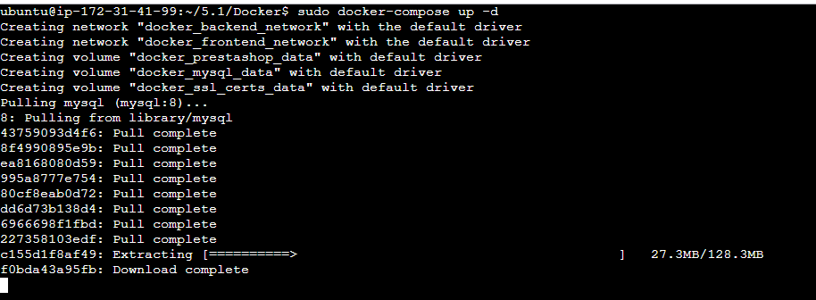
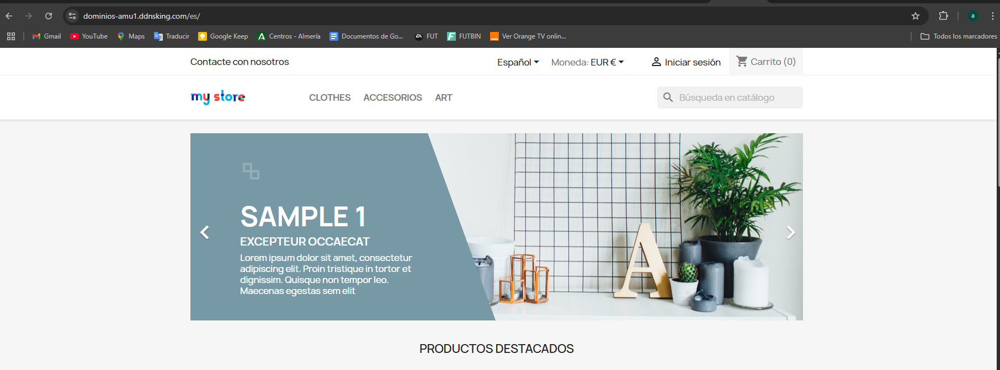

# Practica-Prestashop-Dockercompose
## En está práctica vamos a instalar prestashop/prestashop con docker compose
### Para ello antes de empezar debemos instalar docker-compose y docker
#### El comando para instalar docker es:
~~~
sudo apt install docker.io
~~~
#### NOTA: Si no hacemos un apt update primero a la máquina no nos va a reconocer los comandos
#### El comando para instalar docker-compose es:
~~~
sudo apt install docker-compose
~~~
#### Una vez instalados los comandos creamos nuestro archivo de docker-compose:
~~~
version: '3.4'

services:
  mysql:
    image: mysql
    #command: --default-authentication-plugin=mysql_native_password
    ports: 
      - 3306:3306
    environment: 
      - MYSQL_ROOT_PASSWORD=${MYSQL_ROOT_PASSWORD}
      - MYSQL_DATABASE=${MYSQL_DATABASE}
      - MYSQL_USER=${MYSQL_USER}
      - MYSQL_PASSWORD=${MYSQL_PASSWORD}
    volumes: 
      - mysql_data:/var/lib/mysql
    networks: 
      - backend-network
    security_opt:
      - seccomp:unconfined
    restart: always
  
  phpmyadmin:
    image: phpmyadmin
    ports:
      - 8080:80
    environment: 
      - PMA_ARBITRARY=1
    networks: 
      - backend-network
      - frontend-network
    restart: always
    depends_on: 
      - mysql

  prestashop:
    image: prestashop/prestashop:8
    environment: 
      - DB_SERVER=mysql
      - DB_USER=${DB_USER}
      - DB_PASSWD=${DB_PASSWD}
      - DB_PREFIX=${DB_PREFIX}
      - DB_NAME=${DB_NAME}
      - PS_DOMAIN=${PS_DOMAIN}
      - PS_LANGUAGE=${PS_LANGUAGE}
      - PS_COUNTRY=${PS_COUNTRY}
      - PS_ENABLE_SSL=1
      - PS_INSTALL_AUTO=1
      - ADMIN_MAIL=${ADMIN_MAIL}
      - ADMIN_PASSWD=${ADMIN_PASSWD}
    volumes:
      - prestashop_data:/var/www/html
    networks: 
      - backend-network
      - frontend-network
    restart: always
    depends_on: 
      - mysql

  https-portal:
    image: steveltn/https-portal:1
    ports:
      - 80:80
      - 443:443
    restart: always
    environment:
      DOMAINS: '${DNS_DOMAIN_SECURE} -> http://prestashop:80'
      STAGE: 'production'
    networks:
      - frontend-network

volumes:
  mysql_data:
  prestashop_data:

networks: 
  backend-network:
  frontend-network:
~~~
### Y el archivo de variables será el siguiente
~~~
DNS_DOMAIN_SECURE=dominios-amu1.ddnsking.com
MYSQL_ROOT_PASSWORD=root
MYSQL_DATABASE=prestashop
MYSQL_USER=ps_user
MYSQL_PASSWORD=admin
DB_NAME=prestashop
DB_USER=ps_user
DB_PASSWD=admin
DB_PREFIX=ps_
PS_DOMAIN=dominios-amu1.ddnsking.com
PS_LANGUAGE=es
PS_COUNTRY=ES
ADMIN_MAIL=demo@prestashop.com
ADMIN_PASSWD=prestashop_demo
~~~
### Cosas relevantes a la hora de hacer el docker-compose
### En el docker hemos instalado prestashop/prestashop, phpmyadmin, mysql y https-portal para que tenga el certificado de lets encrypt 
#### IMPORTANTE: 
#### - No cambiar los valores de las variables de dockerhub ya que si no no nos funcionará 
#### - Poner el stage del https portal en production por que si no no va a verificar el certificado
### Una vez hecho todo esto ejecutamos el comando:
~~~
sudo docker-compose up -d
~~~
### Para levantar el contenedor y ya nos saldrá en nuestro dominio nuestro prestashop.

# Imagenes

